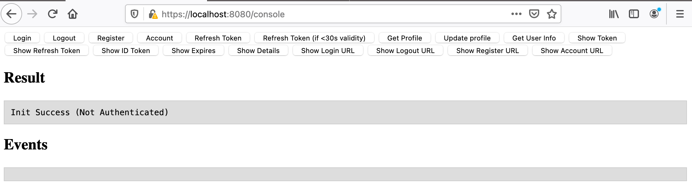

# Exemplo de Aplicação Segura usando Spring Boot

> Esta aplicação foi criada usando a automação disponibilizada pela Red Hat em: https://developers.redhat.com/launch/ e selecionado a versão **REST API Level 0**
>
> A versão original disponibilizada se encontra na branch deste projeto com o nome de **original**. Na branch `master` temos a versão customizada.


## Estrutura das Pastas

```shell
.
├── LICENSE
├── README.md								# esta documentação
├── rhsso-config						# configuração a ser utilizada no RHSSO
│   └── realm-export.json		# realm com cliente configurado que poderá ser importado no RHSSO (não tem usuário)
├── doc
│   └── launch-configuration.png
├── pom.xml
├── scripts									# scripts para facilitar configuração
│   ├── build-run.sh
│   ├── conectividade.sh
│   ├── hml.env
│   ├── local.env
│   └── run.sh
└── src
    ├── licenses
    └── main
        ├── java
        │   └── dev
        │       └── snowdrop
        │           └── example
        │               ├── RestApplication.java
        │               ├── SecurityConfiguration.java
        │               ├── jwt
        │               │   ├── JwtProperties.java
        │               │   └── KeycloakAuthenticationConverter.java
        │               └── service
        │                   ├── Greeting.java
        │                   ├── GreetingController.java
        │                   └── GreetingProperties.java
        ├── resources
        │   ├── application.yaml
        │   └── static
        │       └── js
        │           └── keycloak-3.1.0.min.js
        └── webapp
            └── WEB-INF
                └── jsp
                    └── index.jsp
```


## Construção

```shell
mvn clean package
```


## RHSSO

### Importar Realm

Importar o arquivo [realm-export.json](rhsso-config/realm-export.json)

> **Realm**: demo
>
> **Client**: demoapp


### Chave Pública

Copiar a chave pública do Realm para o ambiente que ser quer testar.

> Homologação - copiar para a variável `SSO_PUBLIC_KEY` que esta disponível em [hml.env](scripts/hml.env)


### Usuário


## Execução Terminal

> Foi customizada por **ambiente** foi feita para rodar **localmente** e num outro (no caso **hml** - homologação).
>
> Abrir 2 terminais

```shell
# terminal 01 - iniciar a aplicação passando o ambiente hml - senão for informado usará local
$ sh scripts/run.sh hml
```


```shell
# terminal 02 - testar a aplicação passando o ambiente hml - senão for informado usará local
$ sh scripts/conectividade.sh hml
*** Running conectividade.sh ***
** loading environments
** ==> hml
** API_URL=https://localhost:8080/api/openstack-users/hello?name=World
** SSO_AUTH_SERVER_URL=https://XXXX.YYY.com.br
** SSO_REALM=demo
** SSO_RESOURCE (client_id)=demoapp
** SSO_PUBLIC_KEY=MIIBIjANBgkqhkiG9w0BAQEFAAOCAQ8AMIIBCgKCAQEArd...
** SSO_USERNAME=usuario1
** SSO_PASSWORD=usuario1
*** Run time: Thu May 20 09:35:52 -03 2021 @ rfelix-mac

** reusing token eyJhbGciOiJSUzI1NiIsInR5cCIgOiAiSldUIiwia2lkIiA6ICJDMS12cW1..
** TOKEN=eyJhbGciOiJSUzI1NiIsInR5cCIgOiAiSX25hbWUiO...

Token header
------------
{
  "typ": "JWT",
  "alg": "RS256",
  "kid": "C1-vqma9tsoN5eM8PJ-ciG3pJyiCOGzJVmLcF5OiQio"
}

Token claims
------------
{
  "acr": "1",
  "allowed-origins": [
    "*"
  ],
  "aud": "account",
  "azp": "demoapp",
  "email": "usuario1@t.com",
  "email_verified": true,
  "exp": 1621514172,
  "family_name": "um",
  "given_name": "usuario",
  "groups": [
    "openstack-users"
  ],
  "iat": 1621513872,
  "iss": "https://ssocloudplus-sp-stg.cloudalgartelecom.com.br/auth/realms/demo",
  "jti": "14d45eda-c637-48ab-bef9-742d2083abe5",
  "name": "usuario um",
  "preferred_username": "usuario1",
  "realm_access": {
    "roles": [
      "offline_access",
      "uma_authorization"
    ]
  },
  "resource_access": {
    "account": {
      "roles": [
        "manage-account",
        "manage-account-links",
        "view-profile"
      ]
    }
  },
  "scope": "profile email",
  "session_state": "0d2e081b-5b21-43e3-ab79-c1418517eaf3",
  "sub": "12d8f36a-976d-46ee-8d78-eb132a48176a",
  "typ": "Bearer"
}
** calling API https://localhost:8080/api/openstack-users/hello?name=World
{"id":5,"content":"Hello, World with role openstack-users!"}%
```

## Execução WEB

Acesse: https://localhost:8080/

> Pagina inicial


> Clicar em **Login**. Você será redirecionado para página inicial de login do RHSSO


> Uma vez que o `usuário1` faz parte do grupo `openstack-users` mostrará o resultado ao clicar em **Invoke**


>  Se for selecionado outro grupo para o `usuário1` como ele faz parte *apenas do grupo* `openstack-users` mostrará o resultado **403** ao clicar em **Invoke**


## Javascript Adapter

> Ajuda entender melhor sobre as funcionalidades

Acesse: https://localhost:8080/console




## Referências

* Documentação Original do Exemplo - https://launcher.fabric8.io/docs/spring-boot-runtime.html#example-rest-http-spring-boot
* OAuth 2.0 Resource Server With Spring Security - https://www.baeldung.com/spring-security-oauth-resource-server
* Cliente JWT - https://github.com/mike-engel/jwt-cli
* Spring Boot com https auto-assinado:
  * https://www.baeldung.com/spring-boot-https-self-signed-certificate
  * https://stackoverflow.com/questions/46670046/adding-crt-to-spring-boot-to-enable-ssl
  * https://stackoverflow.com/questions/17298126/generated-certificate-stops-working-when-moved-to-resources-folder


## Apêndices

Comandos usados para rodar o spring-boot em **https** usando um certificado interno auto-assinado.

```shell
cd keys
# generate
openssl req -newkey rsa:2048 -nodes -keyout key.pem -x509 -days 365 -subj "/C=US/ST=North Carolina/L=Raleigh/O=Red Hat/CN=demo.local.com" -out certificate.pem

# test it
openssl x509 -text -noout -in certificate.pem

# combine key and public certificate
openssl pkcs12 -inkey key.pem -in certificate.pem -passin pass:changeit -passout pass:changeit -export -out certificate.p12

# copy the keystore to app
cp certificate.p12 ../src/main/resources/keystore
```

Configurar o Spring Boot [application.yaml](src/main/resources/application.yaml)

```yaml
server:
  ssl:
    enabled: true
    key-store-type: PKCS12
    key-store: classpath:keystore/certificate.p12
    key-store-password: changeit
```

